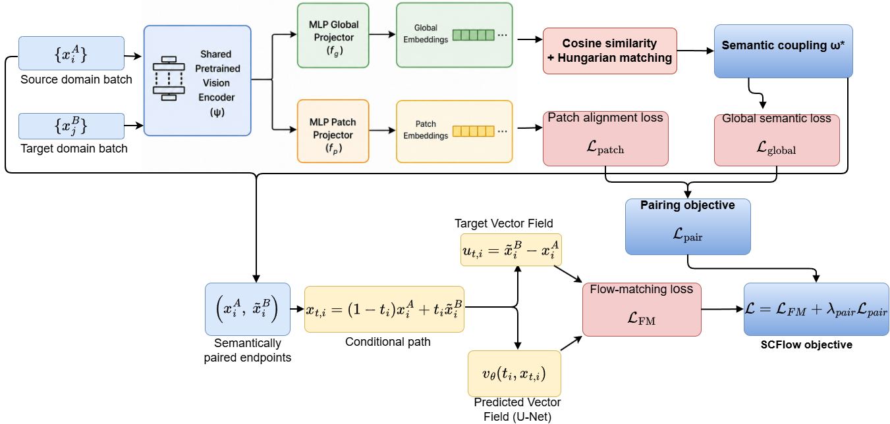

# SCFlow (Semantic Coupling Flow)
SCFlow: Learned Semantic Couplings for Cross-Domain Flow Matching Without Paired Supervision 

## Problem Statement

Flow matching methods rely on geometric coupling costs (squared Euclidean distance), originally designed for generative modeling where source and target share the same manifold (e.g., noise → image). 
When adapted for unpaired cross-domain translation, this geometric cost breaks: the nearest neighbor in pixel space is not the  semantically correct target — semantic correctness and geometric proximity are  
opposite things across a domain gap.

## Approach

A frozen DINOv2 backbone extracts patch and CLS tokens from both domains. Two lightweight MLPs project tokens into a shared embedding space. Hungarian matching on global cosine similarity yields one-to-one semantically optimal pairings, and a patch-level alignment loss enforces local structural correspondence between assigned pairs. The projector trains jointly with the flow model — the coupling  
adapts to the task rather than being fixed by a predetermined cost geometry.

<p align="center">
 
</p>


**We support DDP PyTorch Training**
## Training
### Training Proposed Method, SCFlow
**Note: Run from the main directory**
Run:
```bash
./scripts/train.sh
```

  **Note**:
  - After training, weights will be saved in 'selfcfm_dino' folder

## Inference
The results can be reproduced by running the following command:


## Datasets
### UIEB Dataset
- Paper: "An Underwater Image Enhancement Benchmark Dataset and Beyond"
- Link: https://li-chongyi.github.io/proj_benchmark.html
- Preparation of UIEB Dataset for Image-to-Image Translation
  - Download Images from the Link Above
  - Run: 
         ``` python3.11 preparing_UIEB_dataset.py
         ```
  - Divide dataset, so that train set have 800 images and test set have 90 images

### Cityscapes Dataset
- Paper: "The Cityscapes Dataset for Semantic Urban Scene Understanding"
- Preparation of Cityscapes dataset
   - Follow the information provided in "Unpaired image-to-image translation using cycle-consistent adversarial networks" at the experimental setups.

### Google Map (Aerial -> Photograph)
- Paper: "Unpaired image-to-image translation using cycle-consistent adversarial networks"
- Data can be obtained from the github: https://github.com/junyanz/pytorch-CycleGAN-and-pix2pix


## Acknowledgments
Our code is developed based on [conditional-flow-matching](https://github.com/atong01/conditional-flow-matching) and reproduced under the MIT License. We would like to thanks the authors for the great work. 